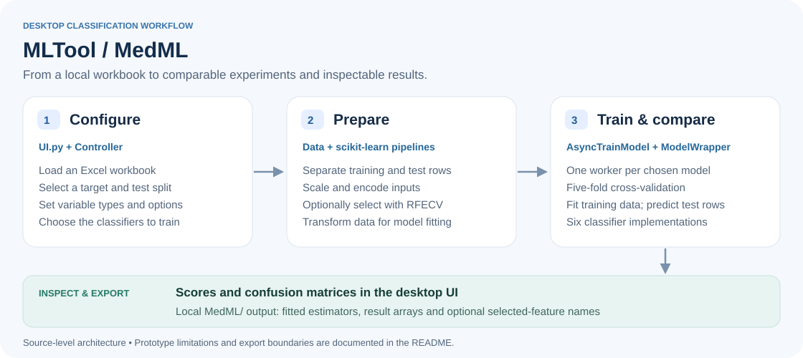

# MLTool · MedML

**A desktop workflow for exploring tabular classification, from Excel input to model comparison.**

MLTool brings data preparation, feature selection, training and inspection into a guided Tkinter interface. The application is labelled **MedML** in the UI; this repository contains the desktop prototype and two earlier Medistics notebooks.

The project demonstrates how a graphical workflow can sit on top of scikit-learn pipelines and a shared model interface. It is a research and learning prototype. It has not been established as a validated clinical tool.

## At a glance

- **Interface:** Python, Tkinter and `ttkwidgets`
- **Data:** Excel workbooks loaded with pandas
- **Modelling:** scikit-learn and XGBoost classifiers
- **Inspection:** cross-validation scores, held-out scores and confusion matrices
- **Export:** estimator files and NumPy result arrays saved locally

## Architecture



The implementation separates the screens in [`UI.py`](UI.py) from the data and model logic in [`DataScience.py`](DataScience.py):

1. **Configure the experiment.** Choose a workbook, target column, held-out fraction and categorical variables.
2. **Prepare the data.** Split training and test rows, configure continuous-variable scaling and categorical encoding, and optionally apply recursive feature elimination with cross-validation (`RFECV`).
3. **Compare classifiers.** A controller starts one training thread per selected model. Each model runs five-fold cross-validation, then fits on the prepared training split and predicts the held-out split.
4. **Inspect and export.** The UI shows mean cross-validation and held-out scores, renders confusion matrices, and exports selected trained estimators and result arrays.

### Classifiers in the current controller

Logistic regression · Support vector classifier · Decision tree · k-nearest neighbours · Extreme gradient boosting · Random forest

The current registry contains classifiers only. The estimator's default `.score()` supplies the displayed score; for these classifiers, that is accuracy. No benchmark or clinical-performance claim is implied by the interface.

## Repository guide

| File | Role |
| --- | --- |
| [`UI.py`](UI.py) | Tkinter entry point, staged configuration screens and result views |
| [`DataScience.py`](DataScience.py) | `Data`, `Controller`, model/test wrappers, threaded training and export |
| [`Medistics_alpha_build.ipynb`](Medistics_alpha_build.ipynb) | Earlier notebook iteration |
| [`Medistics_beta.ipynb`](Medistics_beta.ipynb) | Earlier notebook iteration |
| [`CLI app`](CLI%20app) | Placeholder file; not a working CLI entry point |

## Local exploration

Use a Python environment with Tk support and a graphical desktop. The repository does not currently include a pinned dependency file or an automated test suite. The packages below are inferred from the desktop source imports; this is a starting point, not a verified environment lock.

```bash
python -m venv .venv
# Activate .venv using the command appropriate to your shell.
python -m pip install numpy pandas matplotlib seaborn scikit-learn xgboost joblib ttkwidgets openpyxl
python UI.py
```

Start with a small, synthetic Excel workbook. Choose a **single categorical target**, and explicitly mark it as categorical on the variable-type screen. Prepare missing values and feature types before import; the current workflow does not provide a complete data-cleaning stage. Keep the held-out split and class counts large enough for the selected estimator and five-fold cross-validation.

Dependency compatibility and the UI paths need testing in a suitable environment before relying on results. Notebook execution is a separate workflow and is not required to inspect the desktop source.

### Export behaviour

Export writes to a `MedML/` directory beside the source workbook. Each selected trained model gets a subdirectory containing a `*-Model.joblib` estimator and NumPy test-result arrays. When feature selection is enabled, selected feature names are also saved as `FeatureSelection.npy`.

The export does **not** save the fitted preprocessing/selection pipeline with the estimator, so it is not yet a self-contained inference bundle. Preserve the full transformation procedure before attempting to reuse an exported model. Load serialized models only from a trusted source; [pickle-based formats can execute code when loaded](https://scikit-learn.org/stable/model_persistence.html).

## Current boundaries

The desktop code is an early implementation with several visible gaps:

- **Some controls are incomplete.** PCA is a placeholder. Manual feature selections passed from the UI are not yet applied by `setFeatureSelectedData`.
- **Some option paths need repair.** The UI's `Normalise` label does not match the backend's `Normaliser` key. The ordinal-encoding path receives options written for one-hot encoding.
- **Evaluation needs a reproducibility pass.** The held-out split has a fixed seed, but the shuffled `KFold` objects do not. The folds are not stratified, and the RFECV minimum used during cross-validation is hard-coded separately from the UI setting.
- **Input and result validation are limited.** Single-target classification is the intended path; multiple outputs, small or imbalanced datasets, missing values and empty selections need explicit checks.
- **Clinical use is outside this prototype's scope.** Use synthetic or appropriately governed research data. Accuracy and confusion matrices alone do not establish safety, generalisability or suitability for patient-care decisions.

These boundaries describe the checked-in implementation and make the next engineering steps explicit. The documentation and architecture diagram do not imply that the application or model outputs have been independently validated.
